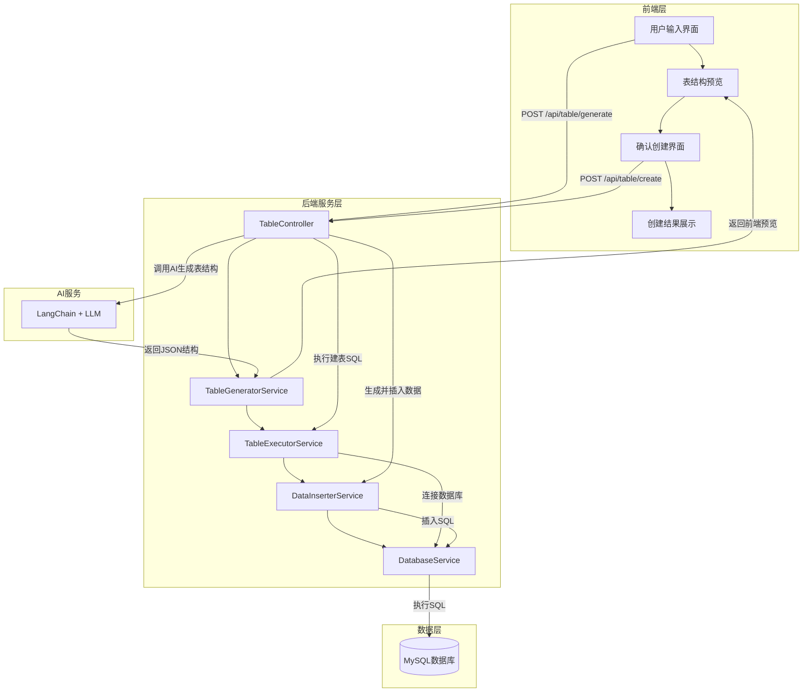
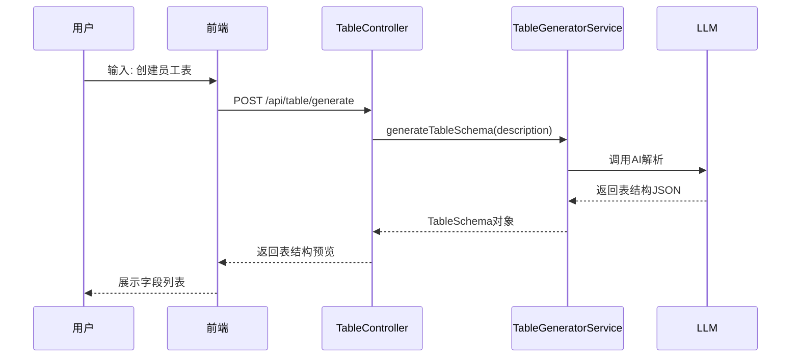
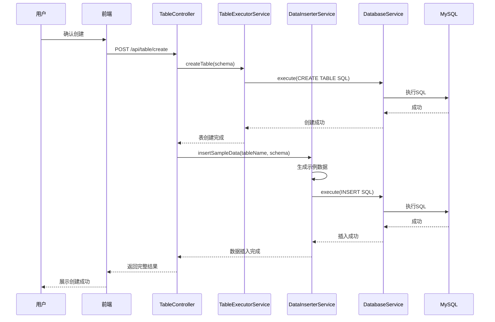

# 自然语言创建数据库表功能设计方案

## 一、功能概述

实现通过自然语言描述创建数据库表的完整流程：
1. 用户输入自然语言描述（如："帮我创建一个员工表"）
2. AI 分析用户意图，生成表名（英文）和中文展示名
3. 后端结合**固定的表结构模板**，组合成最终建表参数
4. 展示给用户确认
5. 用户确认后执行数据库操作（创建表）并插入示例数据

## 二、系统架构



## 三、模块设计

### 3.1 目录结构

```
backend/src/
├── database/                      # 数据库模块
│   ├── database.module.ts         # 数据库模块定义
│   ├── database.service.ts        # 数据库连接服务
│   └── database.interface.ts      # 数据库相关接口定义
│
├── table/                         # 表管理模块
│   ├── table.module.ts            # 表管理模块定义
│   ├── table.controller.ts        # 表管理控制器
│   ├── services/
│   │   ├── table-generator.service.ts    # 表结构生成服务
│   │   ├── table-executor.service.ts     # 表执行服务
│   │   └── data-inserter.service.ts      # 数据插入服务
│   └── dto/
│       ├── generate-table.dto.ts         # 生成表请求DTO
│       ├── create-table.dto.ts           # 创建表请求DTO
│       └── table-result.dto.ts           # 操作结果DTO
│
├── models/                        # 现有模型模块（保持不变）
├── chat/                          # 现有聊天模块（保持不变）
└── app.module.ts                  # 主模块
```

### 3.2 核心模块职责

#### 3.2.1 DatabaseModule - 数据库连接模块

**文件**: `backend/src/database/database.module.ts`

**职责**:
- 管理 MySQL 连接池
- 提供数据库连接服务
- 处理连接错误和重连逻辑

**核心接口**:
```typescript
interface DatabaseConfig {
  host: string;
  port: number;
  user: string;
  password: string;
  database: string;
  charset: string;
}

interface TableSchema {
  tableName: string;
  fields: FieldDefinition[];
}

interface FieldDefinition {
  name: string;
  type: string;
  length?: number;
  nullable?: boolean;
  defaultValue?: any;
  primaryKey?: boolean;
  autoIncrement?: boolean;
  comment?: string;
}
```

#### 3.2.2 TableModule - 表管理模块

**文件**: `backend/src/table/table.module.ts`

**控制器**: `TableController`

**API 端点**:

| 方法 | 路径 | 描述 |
|------|------|------|
| POST | `/api/table/generate` | 根据自然语言生成表结构建议 |
| POST | `/api/table/create` | 执行创建表操作 |
| POST | `/api/table/insert` | 向表中插入数据 |
| GET | `/api/table/preview/:tableName` | 预览表数据 |
| DELETE | `/api/table/:tableName` | 删除表 |

**服务层**:

1. **TableGeneratorService** - 表结构生成服务
   - 调用 LLM 解析自然语言生成表名和描述
   - 将生成的表名与**系统预设的固定表结构模板**结合
   - 返回标准化的表结构 JSON 供前端展示

2. **TableExecutorService** - 表执行服务
   - 执行 CREATE TABLE 语句
   - 处理表已存在等异常
   - 返回执行结果

3. **DataInserterService** - 数据插入服务
   - 根据表结构生成示例数据
   - 执行 INSERT 语句
   - 支持批量插入

## 四、数据流程

### 4.1 表结构生成流程



### 4.2 表创建与数据插入流程



## 五、接口设计

### 5.1 生成表结构接口

**请求**:
```http
POST /api/table/generate
Content-Type: application/json

{
  "description": "创建一个员工表，包含姓名、年龄、职位、部门、入职日期等字段"
}
```

**响应**:
```json
{
  "success": true,
  "data": {
    "tableName": "employees",
    "displayName": "员工表",
    "description": "存储员工基本信息",
    "fields": [
      {
        "name": "id",
        "type": "INT",
        "length": 11,
        "nullable": false,
        "primaryKey": true,
        "autoIncrement": true,
        "comment": "主键ID"
      },
      {
        "name": "name",
        "type": "VARCHAR",
        "length": 50,
        "nullable": false,
        "comment": "员工姓名"
      },
      {
        "name": "age",
        "type": "INT",
        "length": 3,
        "nullable": true,
        "comment": "员工年龄"
      },
      {
        "name": "position",
        "type": "VARCHAR",
        "length": 100,
        "nullable": true,
        "comment": "职位"
      },
      {
        "name": "department",
        "type": "VARCHAR",
        "length": 100,
        "nullable": true,
        "comment": "所属部门"
      },
      {
        "name": "hire_date",
        "type": "DATE",
        "nullable": true,
        "comment": "入职日期"
      },
      {
        "name": "created_at",
        "type": "DATETIME",
        "nullable": false,
        "defaultValue": "CURRENT_TIMESTAMP",
        "comment": "创建时间"
      }
    ],
    "sql": "CREATE TABLE employees (...)"
  }
}
```

### 5.2 创建表接口

**请求**:
```http
POST /api/table/create
Content-Type: application/json

{
  "tableName": "employees",
  "displayName": "员工表",
  "fields": [...],
  "insertSampleData": true
}
```

**响应**:
```json
{
  "success": true,
  "data": {
    "tableName": "employees",
    "created": true,
    "sampleDataInserted": true,
    "rowCount": 5,
    "message": "表创建成功，已插入5条示例数据"
  }
}
```

## 六、前端界面设计

### 6.1 新增页面组件

```
frontend/src/views/
├── TableCreateView.vue      # 表创建主页面
└── components/
    ├── TableForm.vue        # 自然语言输入表单
    ├── TablePreview.vue     # 表结构预览组件
    └── TableResult.vue      # 创建结果展示
```

### 6.2 用户交互流程

1. **输入阶段**: 用户在文本框输入自然语言描述
2. **预览阶段**: 展示 AI 生成的表结构，支持字段编辑
3. **确认阶段**: 用户确认或修改后提交创建
4. **结果阶段**: 展示创建结果和示例数据

## 七、依赖安装

需要安装以下 npm 包：

```bash
cd backend
npm install mysql2 --save
npm install @types/mysql2 --save-dev
```

## 八、安全考虑

1. **SQL 注入防护**: 使用参数化查询
2. **表名验证**: 限制表名格式，防止恶意命名
3. **字段类型验证**: 严格校验字段类型
4. **权限控制**: 后续可添加用户认证

## 九、错误处理

| 错误类型 | 处理方式 |
|---------|---------|
| 数据库连接失败 | 返回友好错误信息，提示检查配置 |
| 表已存在 | 提示用户选择其他表名或删除现有表 |
| SQL 执行失败 | 记录日志，返回详细错误信息 |
| AI 生成失败 | 提供降级方案或重试机制 |

## 十、实施步骤

1. **第一阶段**: 数据库模块搭建
   - 创建 DatabaseModule 和 DatabaseService
   - 配置 MySQL 连接池
   - 测试数据库连接

2. **第二阶段**: 表管理服务开发
   - 实现 TableGeneratorService
   - 实现 TableExecutorService
   - 实现 DataInserterService

3. **第三阶段**: API 接口开发
   - 创建 TableController
   - 实现各 API 端点
   - 编写单元测试

4. **第四阶段**: 前端界面开发
   - 创建表创建页面
   - 实现交互流程
   - 样式优化

5. **第五阶段**: 集成测试
   - 端到端测试
   - 错误场景测试
   - 性能优化

## 十一、后续扩展

1. 支持表结构修改（ALTER TABLE）
2. 支持外键关联
3. 支持索引创建
4. 支持表数据导出
5. 支持多数据库类型（PostgreSQL、SQLite等）
